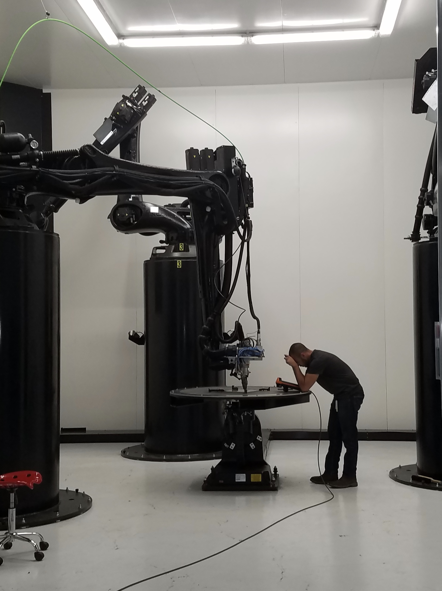

 

# Contact: 
Email • [jordan@embedded.ventures](mailto:jordan@embedded.ventures)  
Website • https://jdnoone.com  
Github • https://github.com/JordanNoone  
Twitter • https://twitter.com/j_d_noone  
LinkedIn • https://www.linkedin.com/in/jordan-noone/  

# My Bio: 
Jordan Noone is an entrepreneur and investor. He co-founded Embedded Ventures and Zoo, and founded Relativity Space.

He invests as a General Partner at Embedded Ventures, an early stage venture capital firm investing in deep tech. He leads portfolio company Zoo as Executive Chairman, the world's only company that develops full stack generative AI hardware design tools.

He founded Relativity Space in 2015, leading the company as Chief Technology Officer for five years and pioneering the development of 3D-printed orbital rockets. Relativity Space was part of Y Combinator's Winter 2016 batch and is now led by former Google CEO Eric Schmidt.

He has had a lifelong interest in aerospace and began designing and building spaceflight hardware at the University of Southern California. Jordan led USC's Rocket Propulsion Lab and became the first student and youngest individual in the world to receive Federal Aviation Administration clearance to fly a rocket into space.

Jordan is still involved with USC's Rocket Propulsion Lab advising student members, is a member of the USC President's Leadership Council, serves on the USC Astronautical Engineering Board of Advisors, and sponsors the USC K-12 STEM Center's Project Payload.

He received a BS in Aerospace Engineering from the University of Southern California, and lives in the greater Los Angeles area.

# My Projects: 
## Founder:
[Embedded Ventures](https://www.embedded.ventures/) • Co-Founder, General Partner  
[Zoo](https://zoo.dev/) • Co-Founder, Executive Chairman  
[Relativity Space](https://www.relativityspace.com/) • Founder, Former Chief Technology Officer  

## Other Work
[University of Southern California](https://www.president.usc.edu/) • President's Leadership Council   
[USC Astronautical Engineering](https://astronautics.usc.edu/) • Board of Advisors

## Investments - Embedded Ventures Portfolio:
[Akash Systems](http://akashsystemsinc.com/)  
[Anduril](https://www.anduril.com/)  
[Chromatic 3D Materials](https://www.linkedin.com/company/c3dmaterials/)  
[Inversion Space](https://www.inversionspace.com/)  
[OurSky](https://oursky.ai/)  
[Skyryse](https://skyryse.com/)  
[Slingshot Aerospace](https://slingshotaerospace.com/)  
[Zoo](https://zoo.dev/)  
(+ unannounced investments)

## Previous Work:
[SpaceX](https://www.spacex.com/) • Former In-Space Propulsion Engineer, Former Propulsion Intern  
[USC Rocket Propulsion Laboratory](http://www.uscrpl.com/) • Former Chief Engineer and Chief Operations Officer (Lab Lead)  
[Blue Origin](https://www.blueorigin.com/) • Former Engines Intern  
[Hughes Research Laboratories](https://www.hrl.com/) • Former Sensors & Materials Intern  

# Gallery:
<section>

